# Report figures and captions

Screenshots of the simulator dashboard, one per figure of the report, with ready-to-paste captions.

**Common settings (unless a caption says otherwise):** 10 simulated aircraft, random seed 7, prioritised planner, wind 12 kt / gusts 18 kt from 240°, Kempegowda International Airport (BLR) as the reference point. Aircraft IDs such as SIM103 are synthetic identifiers, not real flight numbers. The map background is OpenStreetMap; the airspace, aircraft, restrictions and runway outcomes are all **simulated**. One grid cell is 8 km and one planning step is one minute. In the map, dashed grey lines are each aircraft's original (unimpeded) route, solid coloured lines are the planned routes (red for emergencies), red squares are closed sectors at the chosen time step, and the blue and green markers are the primary and alternate airports.

**Caveat for every figure:** these are outputs of a simplified research model. They are not predictions of real flights, runway assignments or operational decisions.

To reproduce a figure, start the dashboard (`streamlit run app.py`) and choose the scenario, aircraft count, planner and time step given under it.

---

## Chapter 5 — System implementation

### Figure 5.1 — Main dashboard
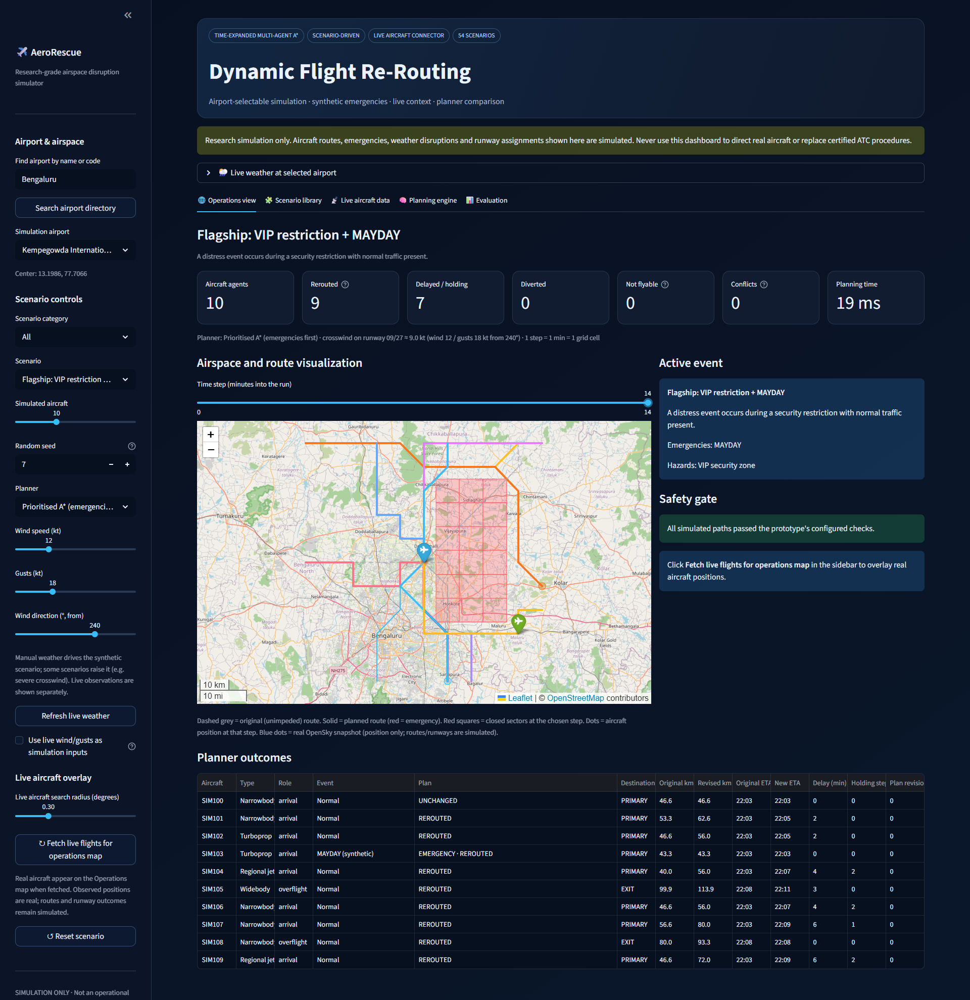

**Caption:** The simulator dashboard running "Flagship: VIP restriction + MAYDAY" (scenario 50) at the final time step. The sidebar holds the airport, scenario, fleet size, seed, planner and weather controls; the metric row summarises the run (10 aircraft, 9 rerouted, 7 delayed, 0 not flyable, 0 conflicts); the map shows the closed VIP zone with original and revised routes; the table below lists each aircraft's plan, distance and arrival time.

*Setup:* scenario 50, 10 aircraft, prioritised planner, time step 14.

### Figure 5.2 — Scenario configuration and airspace
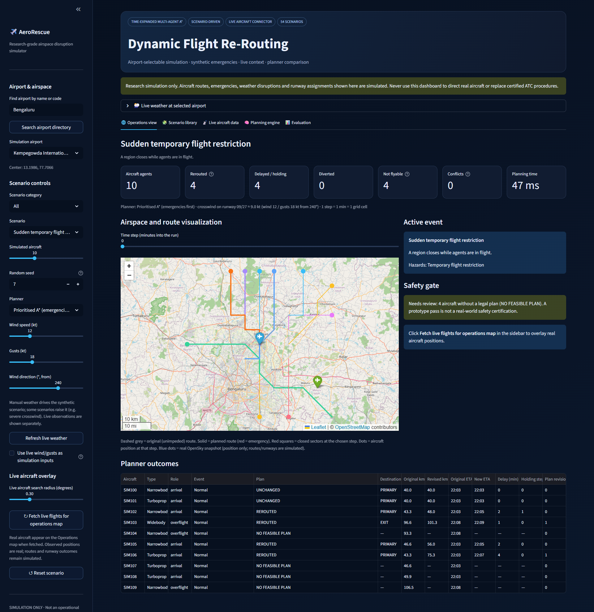

**Caption:** Configuration for "Sudden temporary flight restriction" (scenario 10) at time step 0, before the restriction exists. All routes are still the unimpeded plans. The "Active event" panel states the hazard, which is announced at step 4, and the sidebar shows the selected airport, fleet size, seed, planner and wind.

*Setup:* scenario 10, 10 aircraft, time step 0.

### Figure 5.3 — Original versus revised routes
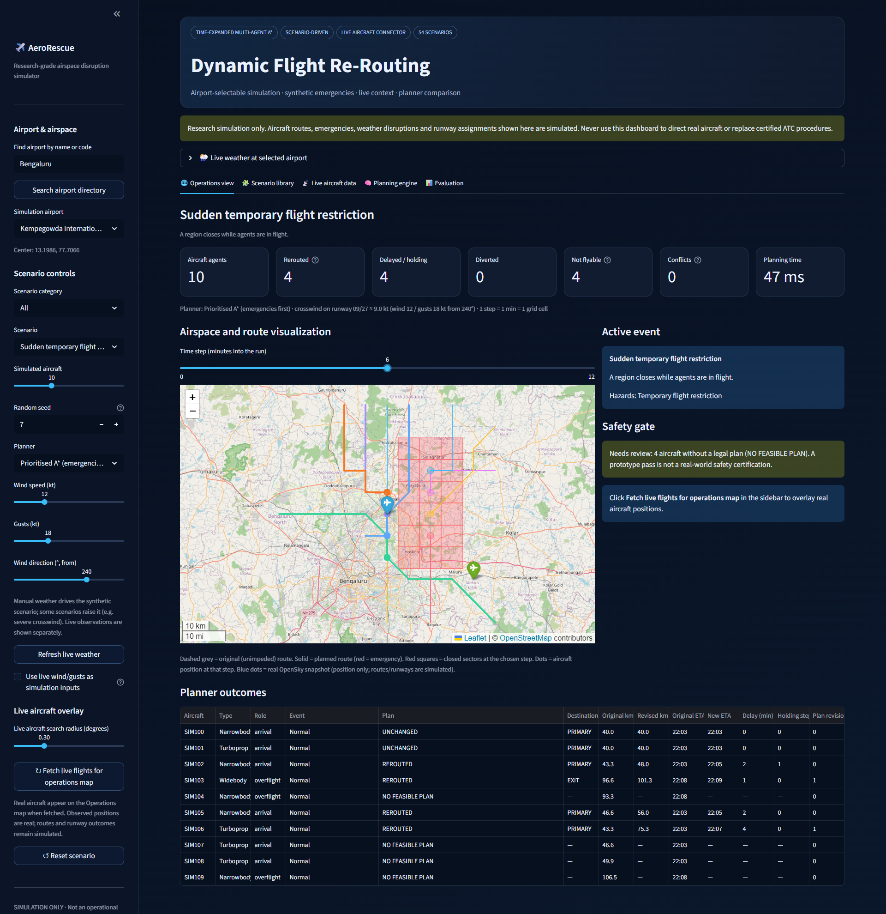

**Caption:** The same run at time step 6, after the restriction was announced at step 4. The red squares are the closed sector as the planner sees it; the solid routes bend around it while the grey dashed lines show the original paths through it. Of the 10 aircraft, 4 were rerouted, 4 delayed and 4 could not be given a legal plan, which the safety gate flags for review.

*Setup:* scenario 10, 10 aircraft, time step 6.

### Figure 5.4 — Metrics panel
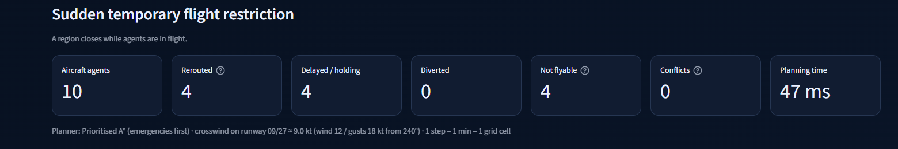

**Caption:** The metric row and run description for scenario 10: 10 aircraft, 4 rerouted, 4 delayed or holding, 0 diverted, 4 not flyable, 0 conflicts. The line beneath gives the planner, the crosswind on runway 09/27 (about 9 kt) and the time and space scale (1 step = 1 minute = 1 grid cell).

*Setup:* scenario 10, 10 aircraft.

### Figure 5.5 — Planner outcomes table
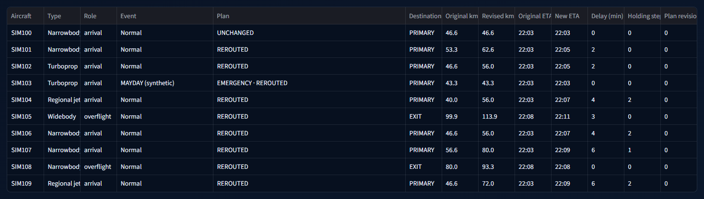

**Caption:** Per-aircraft outcomes for scenario 50: role, event, plan status, destination, original and revised distance, original and new estimated arrival time, delay and holding. SIM103 is the MAYDAY aircraft; its route differs from the unimpeded one but has the same length (43.3 km) and no delay. The largest detour is SIM109, from 46.6 km to 72.0 km. In total the fleet flies 120.2 km further and loses 27 minutes. Arrival times are model estimates, not operational clearances.

*Setup:* scenario 50, 10 aircraft, prioritised planner.

### Figure 5.6 — Scenario library
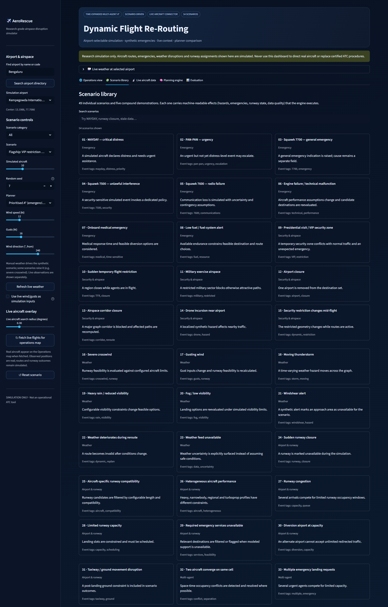

**Caption:** The scenario library tab, listing the 54 scenarios with category, description and tags. Each scenario is backed by executable effects (hazards, emergencies, runway state, data quality) and can be exported as JSON.

### Figure 5.7 — Planning engine description
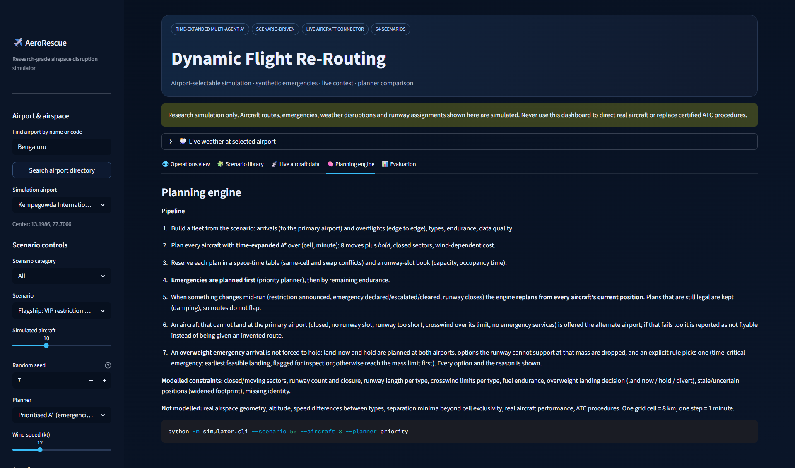

**Caption:** The planning-engine tab describes the pipeline: fleet generation, time-expanded A* with a hold action, space-time and runway reservations, emergency-first ordering, replanning when conditions change, diversion to the alternate airport, and the overweight-landing decision. It also lists what is modelled and what is not.

---

## Chapter 6 — Experiments and results

### Figure 6.1 — Moving thunderstorm (three time steps)
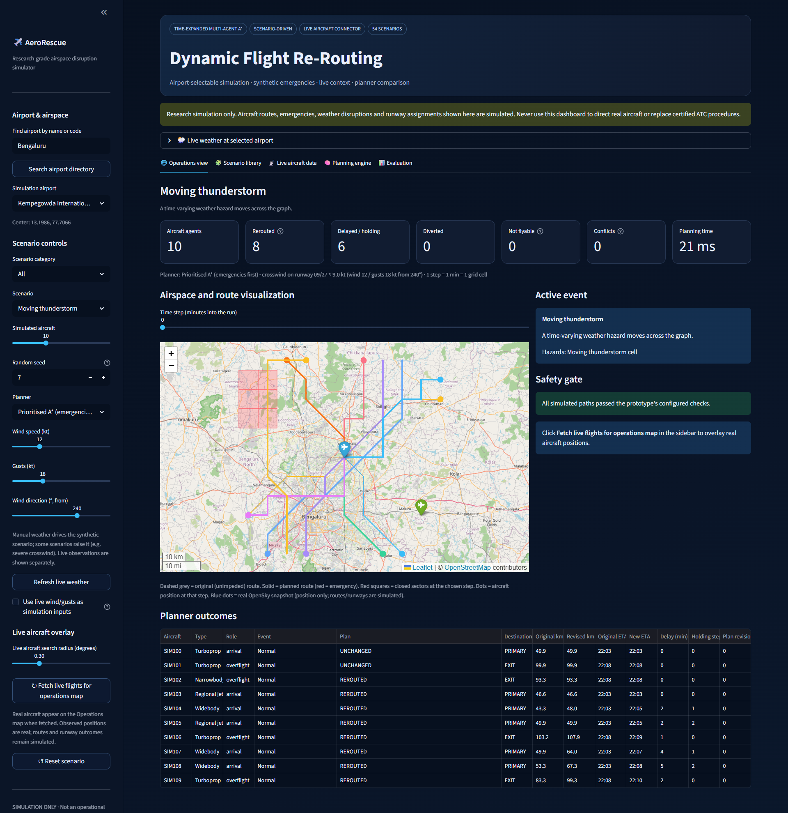

**Caption:** "Moving thunderstorm" (scenario 18) at time steps 0, 6 and 12. A 3×3-cell storm cell drifts across the grid (6 cells at step 0, where it is partly outside the grid, and 9 at steps 6 and 12) and the planner routes around it in space and time. The run reroutes 8 aircraft and delays 6 (53.5 km extra in total, 16 minutes of delay), with every aircraft still flyable and no conflicts.

*Setup:* scenario 18, 10 aircraft.

### Figure 6.2 — Airport closure and diversion
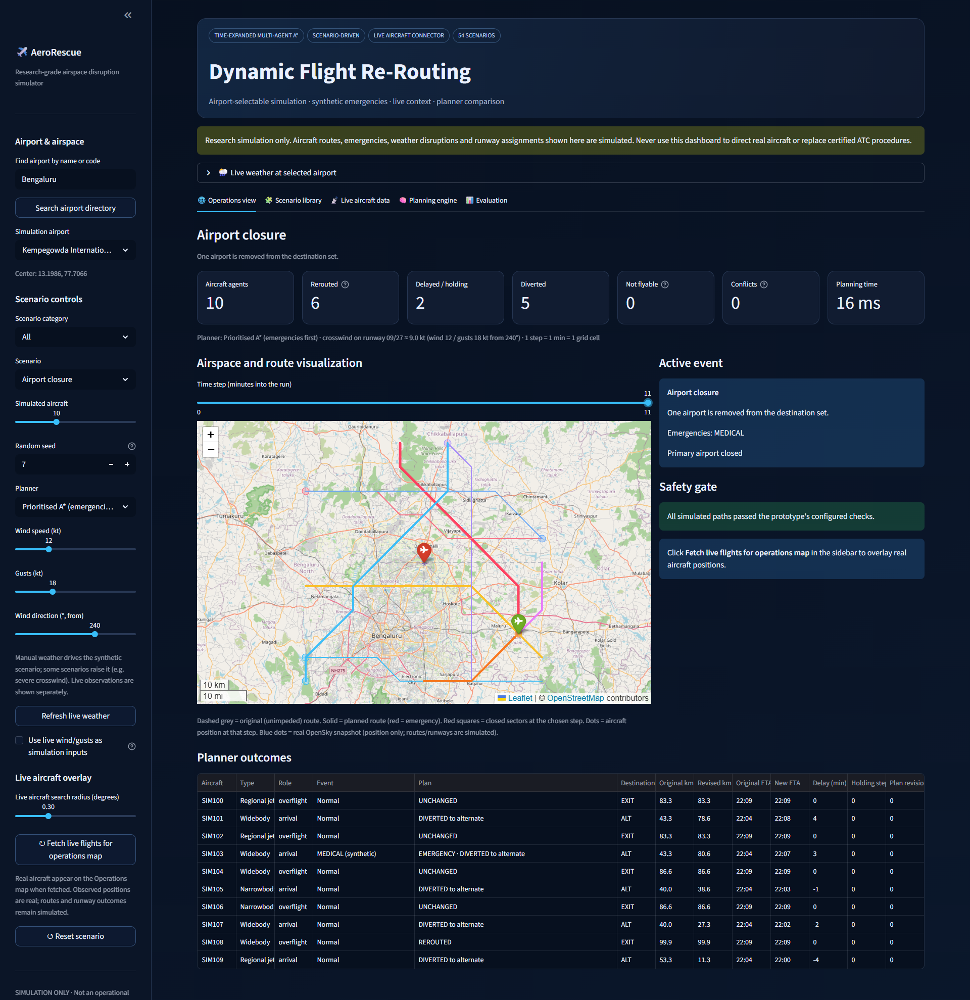

**Caption:** "Airport closure" (scenario 12). The primary airport is closed (red marker), so the 5 arrivals are diverted to the alternate airport (green). Six aircraft are rerouted and 2 delayed, adding 16.6 km and 7 minutes in total.

*Setup:* scenario 12, 10 aircraft, final time step.

### Figure 6.3 — Runway closing mid-run

**Caption:** "Sudden runway closure" (scenario 24). The only runway closes at step 5, which is also the earliest step at which any arrival could touch down (five cells from the edge to the airport). All 5 arrivals are therefore diverted to the alternate airport. The disruption is handled by replanning from each aircraft's current position (6 plan revisions); in total 8 aircraft are rerouted and 7 delayed, adding 225.4 km and 31 minutes.

*Setup:* scenario 24, 10 aircraft, final time step.

### Figure 6.4 — Independent planning (no coordination)
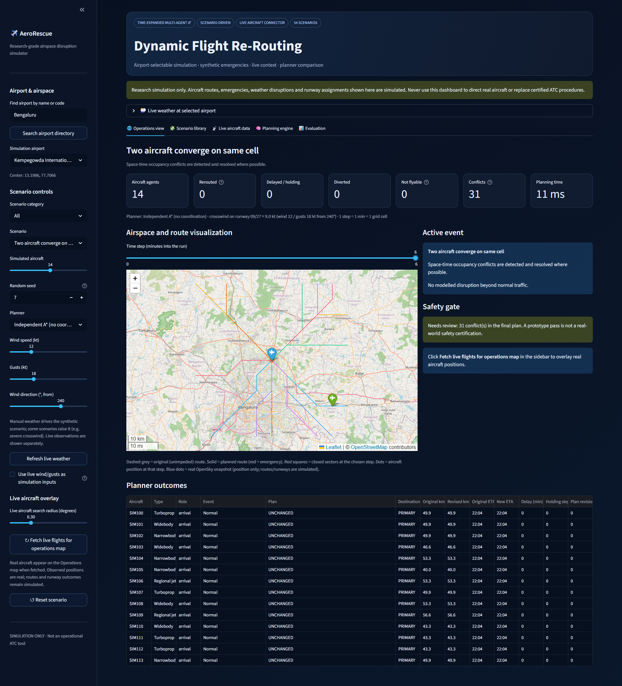

**Caption:** "Two aircraft converge on same cell" (scenario 32) with 14 aircraft and the independent planner, in which each aircraft plans its own shortest route and ignores the others. Every aircraft flies its unimpeded path (0 rerouted, 0 delayed), but the routes converge on the airport and the final plan contains **31 conflicts** (same cell at the same time or head-on swaps), so the safety gate fails.

*Setup:* scenario 32, 14 aircraft, planner "Independent A* (no coordination)", final time step.

### Figure 6.5 — Prioritised planning (coordinated)
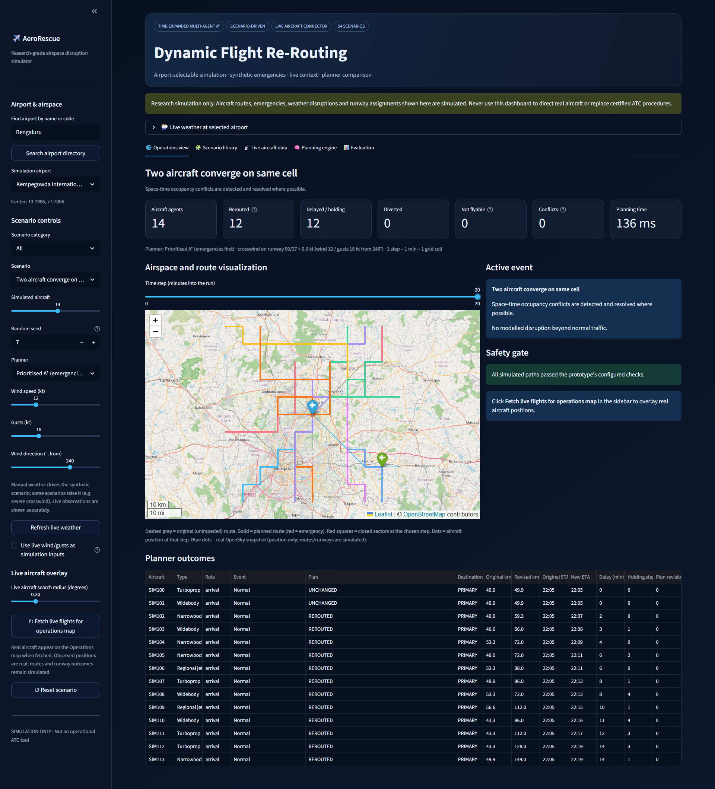

**Caption:** The same scenario and fleet as Figure 6.4 with the prioritised planner. The conflicts drop to **0**. The cost of coordination is visible: 12 aircraft are rerouted and 12 delayed, adding 524.6 km and 98 minutes in total across the fleet.

*Setup:* scenario 32, 14 aircraft, planner "Prioritised A* (emergencies first)", final time step.

### Figure 6.6 — Emergency priority versus first-come-first-served
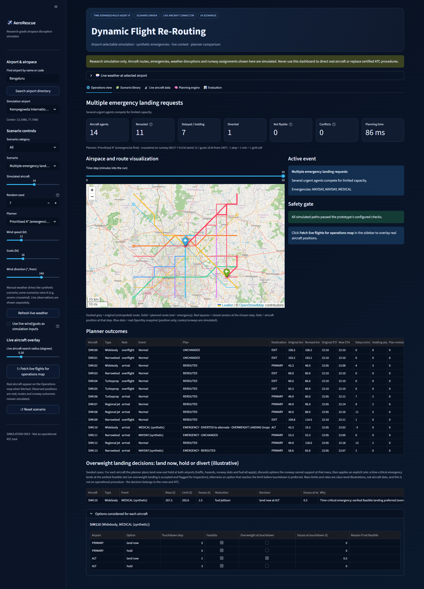

**Caption:** "Multiple emergency landing requests" (scenario 33) with 14 aircraft and three simultaneous emergencies (SIM110, SIM111, SIM113), planned by the prioritised planner (top) and by the sequential id-order planner (bottom) on the identical fleet. Both produce conflict-free plans, but emergency delay differs: with priority the three emergencies are delayed by −3, 0 and +2 steps (total 2 minutes, where a negative value means an earlier touchdown than the unimpeded plan), against −3, +9 and +13 steps (total 22 minutes) without. Ordering emergencies first removes most of the delay they would otherwise suffer.

*Setup:* scenario 33, 14 aircraft, final time step; planners "Prioritised A*" and "Sequential A* (id order)". This is a single seed; the benchmark in `results/` gives means over 10 seeds.

### Figure 6.7 — Crosswind limit
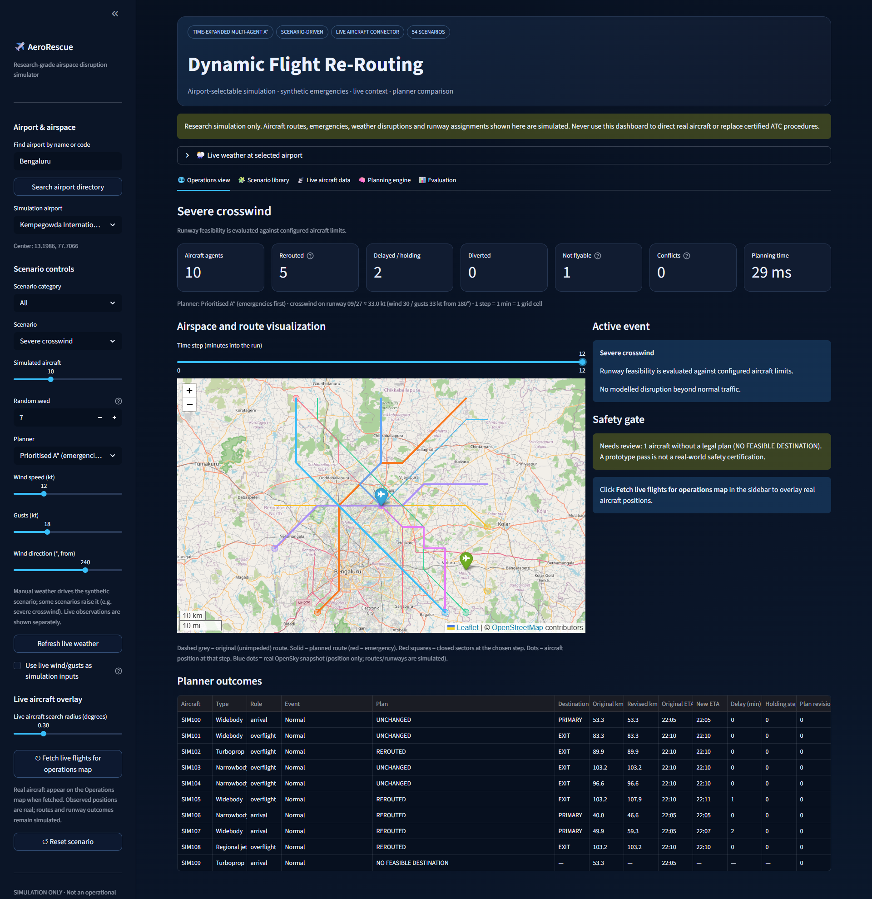

**Caption:** "Severe crosswind" (scenario 16). The scenario raises the wind to 30 kt, gusting 33 kt, from 180°, which is a full crosswind of 33 kt on runway 09/27. Per-type limits are illustrative (turboprop 25 kt, regional jet 30 kt, narrowbody 33 kt, widebody 38 kt). The turboprop SIM109 has no feasible destination at either airport and is reported as not flyable rather than given an invented route.

*Setup:* scenario 16, 10 aircraft, final time step.

### Figure 6.8 — No feasible destination
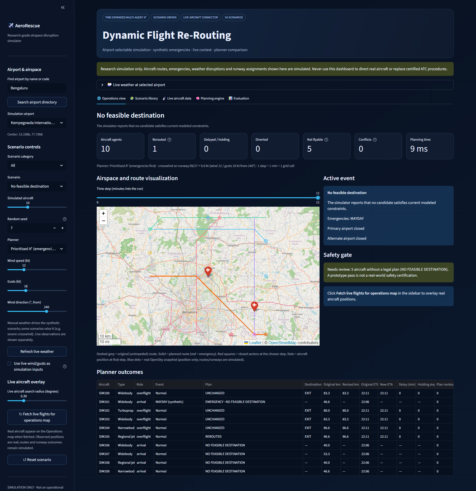

**Caption:** "No feasible destination" (scenario 49). Both airports are closed. The 5 arrivals are reported as `NO FEASIBLE DESTINATION` and never leave their start cell; the overflights, which do not need an airport, still receive plans. The safety gate escalates the case for review instead of producing a route.

*Setup:* scenario 49, 10 aircraft, final time step.

### Figure 6.9 — Infeasible plans after a late restriction

**Caption:** Failure case in "Sudden temporary flight restriction" (scenario 10) at the final step. Four aircraft (SIM104, SIM107, SIM108, SIM109) have no legal plan. All four were already inside the sector when it closed at step 4; the model forbids moving into closed cells and moves one cell per step, so an aircraft in the interior of the 3-cell-wide closure has no legal move. This is a limitation of the simplified model, not a prediction: a real restriction would give aircraft time and a way to leave.

*Setup:* scenario 10, 10 aircraft, final time step.

### Figure 6.10 — Overweight landing decisions

**(a) Time-critical emergency lands now**
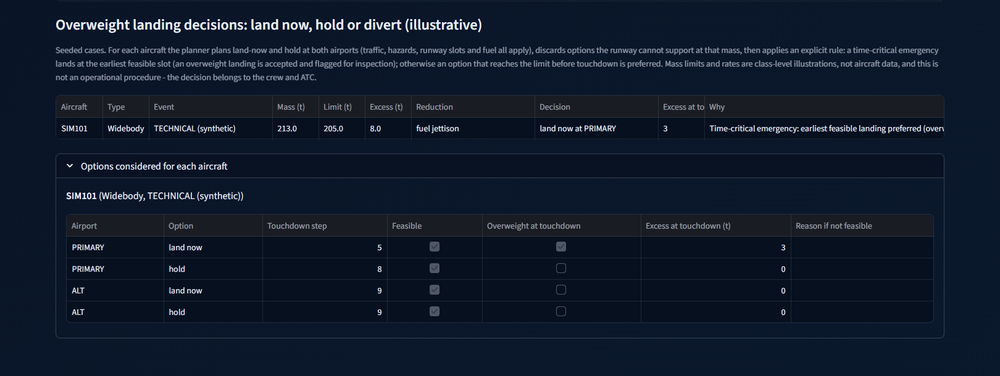

**Caption:** "Engine failure / technical malfunction" (scenario 6). The widebody SIM101 is above its illustrative maximum landing mass. The planner evaluates land-now and hold at both airports; the options table lists each touchdown step and whether it would be overweight. Because the emergency is time-critical, the earliest feasible option is chosen: land now at the primary airport at step 5 with 3.0 t above the limit, flagged for post-landing inspection. Holding would reach the limit but land at step 8, and the alternate airport at step 9.

*Setup:* scenario 6, 10 aircraft, final time step.

**(b) Escalation to MAYDAY**
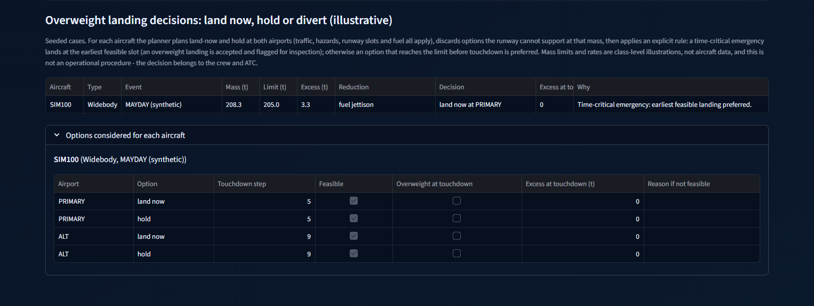

**Caption:** "PAN-PAN escalates to MAYDAY" (scenario 40). At step 5 the aircraft's status escalates and it is replanned under the time-critical rule. SIM100 (a widebody that can jettison fuel) lands at the primary airport at step 5; by then it has reduced 3.3 t of excess mass, so the landing is within the limit and land-now and hold coincide. Touchdown steps are absolute (5 at the primary airport, 9 at the alternate).

*Setup:* scenario 40, 10 aircraft, final time step.

**(c) Non-urgent emergency reduces mass first**
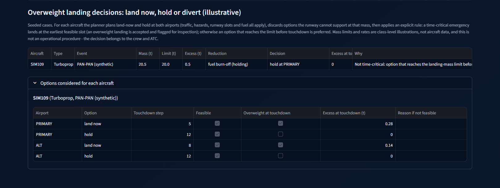

**Caption:** "PAN-PAN — urgency" (scenario 2). For a non-time-critical emergency the rule prefers an option that reaches the mass limit before touchdown. The turboprop SIM109 holds and lands at the primary airport at step 12 within the limit, rather than landing at step 5 overweight.

*Setup:* scenario 2, 10 aircraft, final time step.

> The mass limits, reduction rates and landing-distance factor behind Figure 6.10 are class-level illustrations, not aircraft data, and the decision rule is not an operational procedure. The decision belongs to the crew and ATC.

### Figure 6.11 — Degraded position data
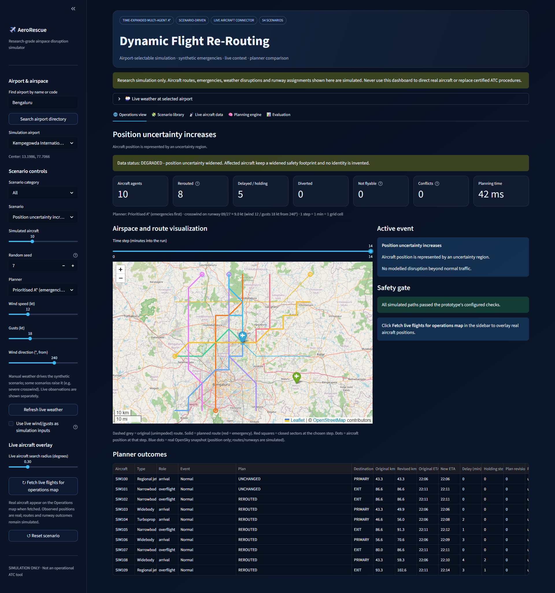

**Caption:** "Position uncertainty increases" (scenario 44). A banner reports the degraded data status and every aircraft is marked "uncertain" in the table. The planner keeps other aircraft out of the cells adjacent to each uncertain aircraft, which makes routing more conservative: 8 aircraft rerouted, 5 delayed, 66.7 km extra and 13 minutes of delay in total, with no conflicts.

*Setup:* scenario 44, 10 aircraft, final time step.

### Figure 6.12 — Replanning damping
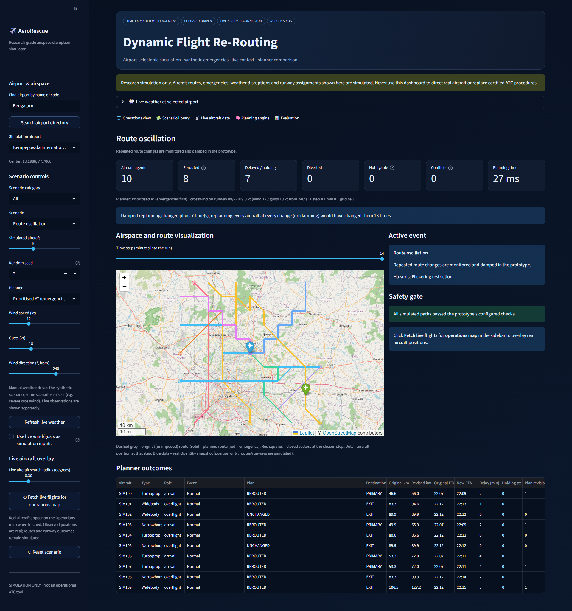

**Caption:** "Route oscillation" (scenario 47). A restriction switches on and off three times (steps 3–6, 9–12 and 15–18). The blue note reports that replanning only when a plan becomes invalid changed plans 7 times, against 13 times if every aircraft were replanned at every change.

*Setup:* scenario 47, 10 aircraft, final time step.

---

## Figures not captured as screenshots
The experiment charts are generated files in [`../results/`](../results): `e1_algorithms.png` (search effort and optimality of BFS, UCS, Greedy and A*), `e3_disruption_size.png`, `e4_wind.png` and `e5_scaling.png`. Their tables are in `results/summary.md`.
